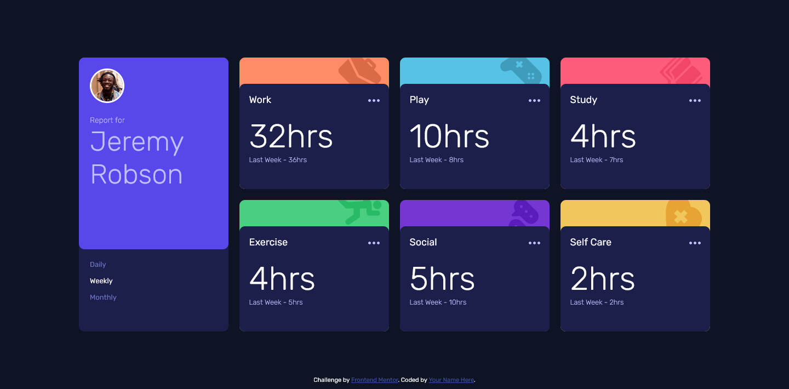

# Frontend Mentor - Time tracking dashboard solution

This is a solution to the [Time tracking dashboard challenge on Frontend Mentor](https://www.frontendmentor.io/challenges/time-tracking-dashboard-UIQ7167Jw). Frontend Mentor challenges help you improve your coding skills by building realistic projects. 

## Table of contents

- [Overview](#overview)
  - [The challenge](#the-challenge)
  - [Screenshot](#screenshot)
  - [Links](#links)
- [My process](#my-process)
  - [Built with](#built-with)
  - [What I learned](#what-i-learned)
  - [Continued development](#continued-development)
- [Author](#author)

## Overview

### The challenge

Users should be able to:

- View the optimal layout for the site depending on their device's screen size
- See hover states for all interactive elements on the page
- Switch between viewing Daily, Weekly, and Monthly stats

### Screenshot

### Links

- Solution URL: [https://github.com/Ihezie/time-tracking-dashboard.git](https://github.com/Ihezie/time-tracking-dashboard.git)
- Live Site URL: [time-tracking-dashboard-website](https://time-tracking-dashboard-website.netlify.app/)

## My process

### Built with

- Semantic HTML5 markup
- CSS custom properties
- Flexbox
- CSS Grid
- Mobile-first workflow
- [React](https://reactjs.org/) - JS library

### What I learned
The HTML, CSS and Vanilla Javascript parts of this project were not much of a challenge for me. The real challenge was working with the React library on a solo project for the first time. Working on this simple project has really helped me see the usefulness of a component based development process and allowed me to familiarize myself with all the other nifty features that React offers, such as the useState and useEffect hooks. 

### Continued development
I plan to focus on learning how to implement other useful React features in future projects, as well as writing more maintainable and concise code.

## Author
- Frontend Mentor - [@Ihezie](https://www.frontendmentor.io/profile/Ihezie)

